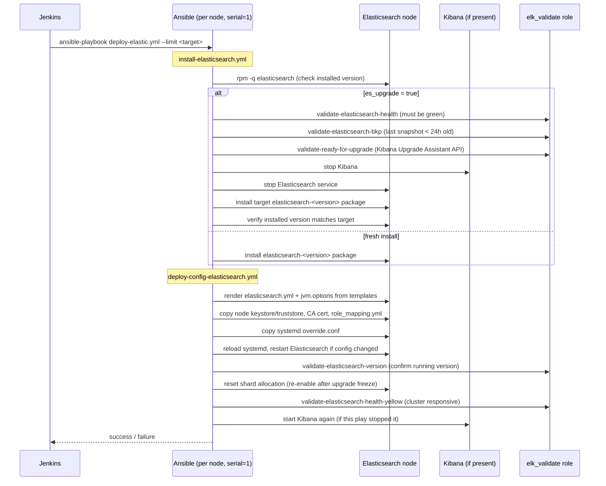

# Elasticsearch Deployment & Upgrade — How It Works

This repository automates the install, configuration, and version upgrade of
an on-prem Elasticsearch (+ Kibana) cluster using **Ansible**, orchestrated
through a **Jenkins** pipeline. This document explains the moving parts, how
they fit together, and how to run it — for anyone new to the repo.

> 🔒 **Before you read on:** this repo contains **no real hostnames,
> credentials, or certificates** — see [SECURITY.md](SECURITY.md) for what
> was removed and what you need to supply yourself.

---

## 1. The three actors

| Actor | Where it lives | What it does |
|---|---|---|
| **Git repository** (this repo) | GitHub | Stores the Ansible playbooks/roles, inventories, and the `Jenkinsfile` pipeline definition. Nothing here executes anything by itself. |
| **Jenkins** | Your CI/CD server | Provides a form (build parameters) for a human to trigger a deployment/upgrade, checks out this repo, and runs `ansible-playbook` on a controller. |
| **Ansible control node** | A Jenkins agent / dedicated VM | Actually connects over SSH to the target Elasticsearch/Kibana nodes and makes the changes. |
| **Elasticsearch / Kibana nodes** | Your `at` / `production` inventory | The machines being installed, configured, or upgraded. |

Nothing runs automatically on a schedule — every run is a **human-triggered
Jenkins build** with explicit parameters, and defaults to a **dry run**
(`--check --diff`) unless someone unchecks that box.

---

## 2. Repository layout

```
.
├── ansible.cfg                     # Ansible defaults (inventory, forks, ssh opts)
├── playbooks/
│   └── deploy-elastic.yml          # Entry-point playbook (hosts: all, serial: 1)
├── roles/
│   ├── elasticsearch_deploy/       # Install / upgrade / configure Elasticsearch
│   │   ├── tasks/                  #   install-elasticsearch.yml, deploy-config-elasticsearch.yml, ...
│   │   ├── templates/              #   elasticsearch.yml / jvm.options Jinja2 templates
│   │   ├── files/<cluster>/        #   per-cluster certs + AD role mappings (see SECURITY.md)
│   │   └── handlers/               #   "Restart Elasticsearch service"
│   └── elk_validate/               # Pre/post checks used by the role above
│       └── tasks/                  #   cluster health, snapshot age, version, upgrade-readiness...
├── inventories/
│   ├── at/                         # Acceptance Test environment
│   └── production/                 # Production environment
│       ├── hosts                   # ansible_host mappings, grouped by node role
│       └── group_vars/             # es_version, JVM heap sizes, TLS paths, node roles, ...
└── jenkinsfiles/
    ├── Jenkinsfile.deploy-elastic  # The pipeline described below
    └── Jenkinsfile.ansible-lint    # CI check that lints every PR
```

Each Elasticsearch node is assigned one or more **roles** via
`es_node_roles` in `group_vars` (master, data_hot, data_warm, data_cold,
data_frozen, ingest, ml, transform, remote_cluster_client, fleet), matching
the [hot-warm-cold-frozen tiered architecture](https://www.elastic.co/guide/en/elasticsearch/reference/current/data-tiers.html)
Elasticsearch recommends for log/observability clusters.

---

## 3. End-to-end flow


**In words:**

1. An engineer changes a role, template, or inventory value on a branch and
   opens a **pull request** against this repository.
2. **Every pull request automatically triggers `Jenkinsfile.ansible-lint`**
   — this is a Jenkins CI job, separate from the deploy pipeline, that runs
   `ansible-lint` against `playbooks/` and `roles/`. It's the repo's only
   fully automatic trigger, it never touches real infrastructure, and a PR
   should not be merged if it fails.
3. Once the lint check passes and the PR is merged, **nothing deploys by
   itself.** A human opens the separate **`Jenkinsfile.deploy-elastic`** job
   in Jenkins and fills in the build parameters (see §4).
4. Jenkins checks out this repo (it's configured as *"Pipeline script from
   SCM"*), validates the parameters, assembles the exact
   `ansible-playbook` command, and runs it on a labeled Ansible controller
   agent — this is the same Jenkins server, just a different job/pipeline
   than the CI lint check.
5. Ansible connects over SSH to the hosts matching `--limit` in the chosen
   environment's inventory (`inventories/at/hosts` or
   `inventories/production/hosts`) and runs the `elasticsearch_deploy` role
   against them, one host at a time (`serial: 1`).
6. If `DRY_RUN` is unchecked, a `Verify` stage SSHes back in and prints
   `systemctl status elasticsearch` for a quick sanity check in the Jenkins
   console output — this is the "Feedback & Monitor" step in the diagram
   above.

> The diagram is generated from `docs/generate_diagram.py` (matplotlib) —
> edit that script and re-run it to update `docs/deployment-architecture.svg`
> if the pipeline changes.

---

## 4. Jenkins pipeline parameters

Opening **Jenkinsfile.deploy-elastic** presents this form:

| Parameter | Purpose | Example |
|---|---|---|
| `ENV` | Which inventory to use | `at` or `production` |
| `ANSIBLE_USER` | Your AD/SSH account for the run | `your-ad-account@ad.example.com` |
| `ANSIBLE_PASSWORD` | SSH password (masked, never logged) | *(hidden)* |
| `BECOME_PASSWORD` | sudo/become password; leave blank to reuse `ANSIBLE_PASSWORD` | *(hidden)* |
| `LIMIT` | Ansible `--limit` pattern — a single host alias or an inventory group | `es-prod-node1`, `elasticlog_elastic_datahot` |
| `UPGRADE` | Run a version upgrade instead of a plain (re)deploy | `true` / `false` |
| `ES_VERSION` | Target version — **required** when `UPGRADE=true` | `8.19.15` |
| `RESTART` | Force a service restart even without a version change | `true` / `false` |
| `SKIP_TAGS` | Optional `--skip-tags`; `skip_step` bypasses the upgrade-readiness checks below | `skip_step` |
| `DRY_RUN` | Runs `--check --diff` instead of applying changes. **Defaults to `true`.** | `true` / `false` |

### Two supported workflows

**A. Deploy / redeploy configuration** (no version change)
```
ENV=at
LIMIT=elasticlog-at_elastic
UPGRADE=false
DRY_RUN=true   # flip to false once the plan looks right
```

**B. Version upgrade**
```
ENV=production
LIMIT=elasticlog_elastic
UPGRADE=true
ES_VERSION=8.19.15
RESTART=true
DRY_RUN=true   # flip to false once the plan looks right
```

Credentials are never written to disk in the repo or echoed to the console —
the pipeline builds a temporary `--extra-vars @file` with `umask 077`, uses
it for the run, and deletes it in a `trap ... EXIT` regardless of success or
failure.

---

## 5. What the Ansible role actually does

`playbooks/deploy-elastic.yml` runs the single role `elasticsearch_deploy`
against every host in `--limit`, **one host at a time** (`serial: 1`), so a
failure on one node doesn't take out the whole cluster mid-upgrade.



### Safety checks that gate a real upgrade (`es_upgrade: true`)

These only run when `UPGRADE=true`, and can be bypassed with
`SKIP_TAGS=skip_step` if you deliberately need to move fast (e.g. in a
throwaway test environment):

1. **Cluster health must be `green`** before anything is touched.
2. **Last successful snapshot must be < 24 hours old** (checked via the
   Snapshot Lifecycle Management policy).
3. **Kibana's Upgrade Assistant** must report `readyForUpgrade: true` (no
   blocking deprecations).
4. **Downgrades are always rejected**, upgrade or not — the role compares
   the installed version to the target with Ansible's `version` test and
   fails fast rather than silently doing nothing or breaking the cluster.

### Idempotency

Every state-changing task is guarded by `register` + `when`, and services are
only restarted through the `Restart Elasticsearch service` **handler**,
which only fires if something actually changed (`es_config_changed`). Running
the playbook twice in a row with no inventory/version changes is a no-op.

---

## 6. Environments

| Environment | Inventory | Notes |
|---|---|---|
| `dev-sit` | `inventories/dev-sit/` | Unrelated app-tier hosts (EBS/KISOFT) also live in this repo's inventories for historical reasons; not part of the Elasticsearch flow. |
| `at` (Acceptance Test) | `inventories/at/` | Smaller cluster, same roles/topology pattern as production, used to validate an upgrade before it touches prod. |
| `production` | `inventories/production/` | The real cluster, split across master / hot / warm / cold / frozen / fleet node groups. |

Elastic's own guidance is to **always test an upgrade path in a lower
environment first** — this is why the pipeline takes `ENV` as an explicit,
required parameter rather than inferring it, and why `DRY_RUN` defaults to
`true`.

---

## 7. Running it locally (without Jenkins)

You can run the same playbook directly if you have SSH/AD access and the
target inventory populated with real hosts:

```bash
# Dry run against a single AT node
ansible-playbook -i inventories/at/hosts playbooks/deploy-elastic.yml \
  -u <your-ad-account> --become --limit es-at-node1 \
  --check --diff --ask-pass --ask-become-pass

# Real upgrade of one production node
ansible-playbook -i inventories/production/hosts playbooks/deploy-elastic.yml \
  -u <your-ad-account> --become --limit es-prod-node1 \
  -e "es_version=8.19.15 es_upgrade=true es_restart=true" \
  --ask-pass --ask-become-pass
```

Lint locally before opening a PR:

```bash
pip install ansible-lint
ansible-lint playbooks/ roles/
```

---

## 8. Extending this repo

- New node role → add it to the relevant `group_vars` file's
  `es_node_roles` list and to the correct inventory group.
- New environment → copy an existing `inventories/<env>/` folder, update
  `hosts` and `group_vars`, and add it to the Jenkins `ENV` choice
  parameter.
- New validation gate → add a task file under `roles/elk_validate/tasks/`
  and `include_role` it from `install-elasticsearch.yml`, tagged
  `skip_step` if it should be skippable.
